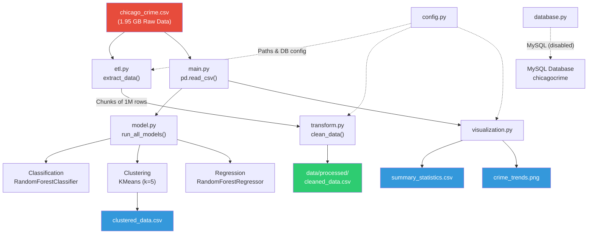

# Crime Data Analytics Pipeline — Comprehensive Project Analysis

> **Author:** Krishna Jodha  
> **Date:** March 8, 2026  
> **Project:** `K:\Projects\Chicago Crime`  
> **Repository:** `N0AH-14/Chicago-Crime`

---

## Table of Contents

1. [Executive Summary](#1-executive-summary)
2. [Project Overview & Objectives](#2-project-overview--objectives)
3. [Dataset Identity & Provenance](#3-dataset-identity--provenance)
4. [Dataset Schema & Data Dictionary](#4-dataset-schema--data-dictionary)
5. [Project Architecture & File Structure](#5-project-architecture--file-structure)
6. [Module-by-Module Code Analysis](#6-module-by-module-code-analysis)
7. [ETL Pipeline Execution History](#7-etl-pipeline-execution-history)
8. [Machine Learning Model Results](#8-machine-learning-model-results)
9. [Visualization & Dashboard Outputs](#9-visualization--dashboard-outputs)
10. [Summary Statistics from Processed Data](#10-summary-statistics-from-processed-data)
11. [Identified Issues & Discrepancies](#11-identified-issues--discrepancies)
12. [Recommendations for Improvement](#12-recommendations-for-improvement)
13. [External Dataset Research Findings](#13-external-dataset-research-findings)
14. [Appendix: Full File Listing](#14-appendix-full-file-listing)

---

## 1. Executive Summary

This project implements a **scalable, modular ETL (Extract-Transform-Load) pipeline** with integrated **machine learning** and **visualization** capabilities for crime data analytics. The pipeline is built in Python and designed to:

- Ingest a large CSV dataset (~1.95 GB) in configurable chunks
- Clean, normalize, and transform raw crime data
- Store processed data in either CSV files or a MySQL database
- Apply classification, clustering, and regression ML models
- Generate statistical summaries and trend visualizations for PowerBI integration

The project was authored by **Krishna Jodha** (`work.noah14@gmail.com`) and has been executed multiple times, processing up to **8,270,316 crime records** across 9 chunks in its most recent full run.

> [!IMPORTANT]
> A critical finding of this analysis is a **dataset identity discrepancy**: the project README references the **Los Angeles Crime Data from 2020 to Present** (LA Open Data Portal), but the actual data file ([chicago_crime.csv](file:///k:/Projects/Chicago%20Crime/data/chicago_crime.csv)) and the database schema columns (IUCR, Beat, Ward, Community Area, FBI Code) unmistakably match the **Chicago Crimes — 2001 to Present** dataset from the Chicago Data Portal. This is detailed in [Section 3](#3-dataset-identity--provenance).

---

## 2. Project Overview & Objectives

### 2.1 Goals

The project was designed to build a data-driven analytics solution supporting **public safety and urban management** decision-making. Specific objectives include:

| Capability | Description |
|---|---|
| **Data Ingestion** | Efficient extraction of large CSV datasets using pandas chunking |
| **Data Transformation** | Cleaning, null handling, type conversion, column normalization |
| **Data Storage** | Loading into MySQL (initially) or CSV export (current approach) |
| **Machine Learning** | Classification (arrest prediction), clustering (crime hotspots), regression (crime count forecasting) |
| **Visualization** | Summary statistics and trend plots for PowerBI dashboards |

### 2.2 Technology Stack

| Component | Technology |
|---|---|
| Language | Python 3.x |
| Data Processing | pandas |
| Database ORM | SQLAlchemy + PyMySQL |
| Machine Learning | scikit-learn (RandomForest, KMeans) |
| Visualization | matplotlib |
| Database | MySQL 3306 |
| Dashboard Target | Microsoft PowerBI |

### 2.3 Dependencies

From [requirements.txt](file:///k:/Projects/Chicago%20Crime/requirements.txt):
```
pandas
sqlalchemy
pymysql
scikit-learn
matplotlib
```

---

## 3. Dataset Identity & Provenance

### 3.1 What the README Claims

The [readme.md](file:///k:/Projects/Chicago%20Crime/readme.md) states the dataset source is:

> **"Crime Data from 2020 to Present"** from the [Los Angeles Open Data Portal](https://data.lacity.org/Public-Safety/Crime-Data-from-2020-to-Present/2nrs-mtv8/about_data)

This LA dataset has the following characteristics:
- Published by: Los Angeles Police Department (LAPD)
- Columns include: `DR_NO`, `DATE OCC`, `TIME OCC`, `AREA`, `AREA NAME`, `Crm Cd`, `Crm Cd Desc`, `Vict Age`, `Vict Sex`, `Vict Descent`, `Premis Cd`, `Weapon Used Cd`, `LAT`, `LON`
- License: CC0 1.0 Universal Public Domain Dedication
- Coverage: 2020 to March 2024 (dataset is now frozen; LAPD transitioned to NIBRS in October 2024)

### 3.2 What the Actual Data Contains

The actual data file is named [chicago_crime.csv](file:///k:/Projects/Chicago%20Crime/data/chicago_crime.csv) (~1.95 GB), and the database schema in [database.py](file:///k:/Projects/Chicago%20Crime/database.py) defines these columns:

| Column | Type | Origin |
|---|---|---|
| `ID` | BIGINT (PK) | **Chicago** |
| `Case Number` | VARCHAR(255) | **Chicago** |
| `Date` | DATETIME | Both |
| `Block` | VARCHAR(255) | **Chicago** |
| `IUCR` | VARCHAR(50) | **Chicago** (Illinois Uniform Crime Reporting) |
| `Primary Type` | VARCHAR(100) | **Chicago** |
| `Description` | VARCHAR(255) | **Chicago** |
| `Location Description` | VARCHAR(255) | **Chicago** |
| `Arrest` | BOOLEAN | **Chicago** |
| `Domestic` | BOOLEAN | **Chicago** |
| `Beat` | VARCHAR(50) | **Chicago** |
| `District` | VARCHAR(50) | **Chicago** |
| `Ward` | INT | **Chicago** |
| `Community Area` | VARCHAR(50) | **Chicago** (77 community areas) |
| `FBI Code` | VARCHAR(50) | **Chicago** |
| `X Coordinate` | DOUBLE | **Chicago** (State Plane) |
| `Y Coordinate` | DOUBLE | **Chicago** (State Plane) |
| `Year` | INT | Both |
| `Updated On` | DATETIME | **Chicago** |
| `Latitude` | DOUBLE | Both |
| `Longitude` | DOUBLE | Both |

### 3.3 Proof from Summary Statistics

The [summary_statistics.csv](file:///k:/Projects/Chicago%20Crime/data/processed/summary_statistics.csv) confirms:

| Metric | Value | Implication |
|---|---|---|
| Total records | **8,270,316** | Chicago dataset (2001–2025) has millions of records |
| Mean Latitude | **41.842** | Chicago (41.88°N), not LA (34.05°N) |
| Mean Longitude | **-87.671** | Chicago (-87.63°W), not LA (-118.24°W) |
| Date range | 2001-01-01 to 2025-03-01 | Matches Chicago "2001 to Present" |
| Top `Primary Type` | THEFT (1,752,874) | Consistent with Chicago crime data |
| Top `Location Description` | STREET (2,161,010) | Consistent with Chicago crime data |
| Top Block | `100XX W OHARE ST` | O'Hare Airport, Chicago |
| 77 Community Areas | max = 77.0 | Chicago has exactly 77 Community Areas |

> [!CAUTION]
> **The dataset is definitively the Chicago Crimes dataset (2001 to Present), NOT the Los Angeles Crime Data.** The README, license attribution, and dataset links are all incorrect for the data being processed. The project directory is also named "Chicago Crime," reinforcing this finding.

### 3.4 Actual Dataset Source

The actual dataset is the **"Crimes — 2001 to Present"** from the [Chicago Data Portal](https://data.cityofchicago.org/Public-Safety/Crimes-2001-to-Present/ijzp-q8t2):

- **Publisher:** Chicago Police Department (CPD)
- **System:** CLEAR (Citizen Law Enforcement Analysis and Reporting)
- **Coverage:** January 1, 2001 to Present (typically excluding the most recent 7 days)
- **Size:** ~1.95 GB / 8.27 million records (as downloaded)
- **Updates:** Refreshed daily
- **License:** Public domain, open data

---

## 4. Dataset Schema & Data Dictionary

Based on the actual Chicago crime dataset and the project's code:

### 4.1 Complete Field Definitions

| # | Field | Data Type | Description |
|---|---|---|---|
| 1 | **ID** | Integer (PK) | Unique identifier for each record (auto-incremented by CPD's CLEAR system) |
| 2 | **Case Number** | String | The Chicago Police Department Records Division Number (RD Number), unique per case |
| 3 | **Date** | DateTime | Date and time when the incident occurred |
| 4 | **Block** | String | Partially redacted street address of the incident (rounded to the nearest hundred block for privacy) |
| 5 | **IUCR** | String | Illinois Uniform Crime Reporting code — a 4-digit code classifying criminal incidents per Illinois state standards |
| 6 | **Primary Type** | String | The primary IUCR code description (e.g., THEFT, BATTERY, CRIMINAL DAMAGE) |
| 7 | **Description** | String | Secondary, more detailed IUCR code description (subcategory of Primary Type) |
| 8 | **Location Description** | String | Where the crime occurred (e.g., STREET, RESIDENCE, APARTMENT, SIDEWALK) |
| 9 | **Arrest** | Boolean | Indicates whether an arrest was made |
| 10 | **Domestic** | Boolean | Indicates whether the incident was domestic-related per the Illinois Domestic Violence Act |
| 11 | **Beat** | String | The police beat where the incident occurred — the smallest police geographic area (each beat has one patrol car) |
| 12 | **District** | String | The police district where the incident occurred (CPD has 22 districts) |
| 13 | **Ward** | Integer | City Council district (ward) where the incident took place (Chicago has 50 wards) |
| 14 | **Community Area** | String | The community area where the incident occurred (Chicago has 77 community areas, defined by the Social Science Research Committee at the University of Chicago in the 1920s) |
| 15 | **FBI Code** | String | Crime classification under the FBI's Uniform Crime Reporting (UCR) program (used for national cross-comparison) |
| 16 | **X Coordinate** | Float | Illinois State Plane East coordinate (feet), projected coordinate system |
| 17 | **Y Coordinate** | Float | Illinois State Plane North coordinate (feet), projected coordinate system |
| 18 | **Year** | Integer | Year the incident occurred |
| 19 | **Updated On** | DateTime | Timestamp when the record was last updated in CLEAR |
| 20 | **Latitude** | Float | WGS84 latitude (shifted from centroid of census block for privacy) |
| 21 | **Longitude** | Float | WGS84 longitude (shifted from centroid of census block for privacy) |
| 22 | **Location** | String | Combined [(Latitude, Longitude)](file:///k:/Projects/Chicago%20Crime/main.py#19-50) tuple — **dropped during transformation** |

### 4.2 Key Dataset Statistics (from summary_statistics.csv)

| Metric | Value |
|---|---|
| **Total Records** | 8,270,316 |
| **Unique Case Numbers** | 8,269,727 (589 duplicates) |
| **Date Range** | Jan 1, 2001 → Mar 1, 2025 |
| **Unique IUCR Codes** | 423 |
| **Unique Primary Types** | 36 crime categories |
| **Unique Descriptions** | 573 sub-categories |
| **Unique Location Descriptions** | 218 |
| **Unique FBI Codes** | 27 |
| **Arrest Rate** | ~25.4% (6,169,453 records with Arrest=False) |
| **Domestic Incidents** | ~17.2% (6,845,589 records with Domestic=False) |
| **Records with Valid Coordinates** | 8,178,736 (~98.9%) |
| **Top Crime Type** | THEFT (1,752,874 records, 21.2%) |
| **Top Location** | STREET (2,161,010 records, 26.1%) |
| **Most Common Description** | SIMPLE (970,767 records) |
| **Mean Year** | 2010.75 (weighted toward earlier data) |

---

## 5. Project Architecture & File Structure

### 5.1 Directory Tree

```
K:\Projects\Chicago Crime\
├── .git/                           # Git repository
├── .gitignore                      # Ignores /data and /__pycache__
├── config.py                       # Configuration: paths, DB credentials
├── database.py                     # SQLAlchemy DB engine + table creation
├── transform.py                    # Data cleaning & transformation logic
├── etl.py                          # ETL pipeline orchestration
├── model.py                        # ML models: classification, clustering, regression
├── visualization.py                # Summary stats, trend plots, data exports
├── main.py                         # Main entry point — orchestrates entire pipeline
├── requirements.txt                # Python dependencies
├── readme.md                       # Project documentation
├── data/
│   ├── chicago_crime.csv           # Raw dataset (1.95 GB, 8.27M records)
│   ├── raw/                        # Empty — intended for intermediate raw data
│   └── processed/
│       ├── cleaned_data.csv        # Cleaned output (1.75 GB)
│       ├── clustered_data.csv      # Clustered output with cluster labels (1.98 GB)
│       ├── crime_trends.png        # Line chart: crimes per year (34 KB)
│       └── summary_statistics.csv  # Descriptive statistics (1.8 KB)
└── logs/
    ├── 1st_Run.log                 # First pipeline execution log
    ├── project - Copy.log          # Partial backup log
    └── project.log                 # Latest full pipeline execution log
```

### 5.2 Architecture Diagram



### 5.3 Data Flow Summary

1. **Extract:** [etl.py](file:///k:/Projects/Chicago%20Crime/etl.py) reads the raw CSV in chunks of 1,000,000 rows using `pd.read_csv(chunksize=1000000)`
2. **Transform:** Each chunk passes through [transform.py](file:///k:/Projects/Chicago%20Crime/transform.py) for cleaning (null filling, type conversion, column drops)
3. **Load:** Cleaned chunks are appended to [data/processed/cleaned_data.csv](file:///k:/Projects/Chicago%20Crime/data/processed/cleaned_data.csv)
4. **Analyze:** [main.py](file:///k:/Projects/Chicago%20Crime/main.py) re-reads the full raw CSV and runs all ML models
5. **Output:** Summary statistics, trend plots, and clustered data exported to `data/processed/`

---

## 6. Module-by-Module Code Analysis

### 6.1 [config.py](file:///k:/Projects/Chicago%20Crime/config.py) — Configuration Module

**Lines:** 16 | **Size:** 350 bytes

This module defines all project configuration as module-level constants:

```python
DATA_FILE = 'data/chicago_crime.csv'       # Raw data location
RAW_DATA_DIR = 'data/raw'                  # Unused raw data directory
PROCESSED_DATA_DIR = 'data/processed'      # Output directory
LOG_FILE = 'logs/project.log'              # Log file path

DB_CONFIG = {
    'host': 'localhost',
    'user': 'ChicagoCrimeClient',
    'password': 'ChicagoCrime',
    'database': 'chicagocrime',
    'port': 3306
}
```

> [!WARNING]
> Database credentials are hardcoded in plain text. In production, these should be loaded from environment variables or a secrets manager.

---

### 6.2 [database.py](file:///k:/Projects/Chicago%20Crime/database.py) — Database Module

**Lines:** 52 | **Size:** 1,712 bytes

Provides MySQL database connectivity via SQLAlchemy:

| Function | Purpose |
|---|---|
| `get_engine()` | Creates a SQLAlchemy engine using `mysql+pymysql://` connection string |
| `create_tables(engine)` | Executes `CREATE TABLE IF NOT EXISTS crimes` with 20 columns |

**Current Status:** The database loading path is **commented out** in `etl.py`. The current pipeline writes to CSV instead of MySQL.

---

### 6.3 [transform.py](file:///k:/Projects/Chicago%20Crime/transform.py) — Data Transformation Module

**Lines:** 46 | **Size:** 1,772 bytes

The `clean_data(df)` function performs the following transformations:

| Step | Operation | Details |
|---|---|---|
| 1 | Fill text nulls | 10 text columns filled with empty string `''` |
| 2 | Fill boolean nulls | `Arrest` and `Domestic` filled with `False` |
| 3 | Convert Year | `pd.to_numeric(errors='coerce')` → fill with 0 → cast to int |
| 4 | Convert coordinates | `X Coordinate`, `Y Coordinate`, `Latitude`, `Longitude` converted to numeric |
| 5 | Parse dates | `Date` and `Updated On` parsed with `pd.to_datetime(errors='coerce')` |
| 6 | Drop Location | The combined `Location` column (redundant tuple of lat/lon) is dropped |

**Text columns cleaned:** `Case Number`, `Block`, `IUCR`, `Primary Type`, `Description`, `Location Description`, `Beat`, `District`, `Community Area`, `FBI Code`

---

### 6.4 [etl.py](file:///k:/Projects/Chicago%20Crime/etl.py) — ETL Pipeline Module

**Lines:** 101 | **Size:** 3,344 bytes

Contains both the **legacy** (MySQL-based, commented out) and **current** (CSV-based) ETL implementations:

#### Current Implementation
| Function | Purpose |
|---|---|
| `extract_data()` | Generator yielding 1,000,000-row chunks from the CSV |
| `run_etl()` | Orchestrates extract → transform → CSV append loop |

#### Legacy Implementation (Commented Out, Lines 1–45)
The original version used smaller chunks (10,000 rows) and loaded directly into MySQL via `df.to_sql(name='crimes', con=engine, if_exists='append')`.

**Key Design Decision:** The chunk size was increased from 10,000 to 1,000,000 when moving from database loading to CSV output, reducing overhead from 827 chunks to just 9.

---

### 6.5 [model.py](file:///k:/Projects/Chicago%20Crime/model.py) — Machine Learning Module

**Lines:** 91 | **Size:** 3,710 bytes

Implements three ML models:

#### Classification — Arrest Prediction
```
Algorithm:  RandomForestClassifier (n_estimators=100, random_state=42)
Features:   Year, X Coordinate, Y Coordinate, Latitude, Longitude
Target:     Arrest (boolean → int)
Split:      80/20 train/test
Metric:     Accuracy score
```

#### Clustering — Crime Hotspot Identification
```
Algorithm:  KMeans (n_clusters=5, random_state=42)
Features:   Latitude, Longitude
Output:     DataFrame with assigned cluster labels
Metric:     Silhouette score (mentioned in docs, not computed in code)
```

#### Regression — Crime Count Forecasting
```
Algorithm:  RandomForestRegressor (n_estimators=100, random_state=42)
Features:   Year
Target:     Crime count per year
Split:      80/20 train/test
Metric:     Mean Squared Error (MSE)
```

The `run_all_models(df)` function orchestrates all three and returns a dictionary of results.

---

### 6.6 [visualization.py](file:///k:/Projects/Chicago%20Crime/visualization.py) — Visualization Module

**Lines:** 46 | **Size:** 1,691 bytes

| Function | Output | Description |
|---|---|---|
| `generate_summary_statistics(df)` | `summary_statistics.csv` | `df.describe(include='all')` saved as CSV |
| `plot_crime_trends(df)` | `crime_trends.png` | Line chart of crimes per year with markers |
| `export_clustered_data(clustered_df)` | `clustered_data.csv` | Full DataFrame with cluster labels exported |

---

### 6.7 [main.py](file:///k:/Projects/Chicago%20Crime/main.py) — Main Entry Point

**Lines:** 53 | **Size:** 1,902 bytes

Orchestrates the complete pipeline:

```
1. setup_logging()         → Configure logging to file + console
2. run_etl()               → Extract, transform, save cleaned CSV
3. pd.read_csv(DATA_FILE)  → Re-read the FULL raw dataset into memory
4. run_all_models(df)      → Run classification, clustering, regression
5. generate_summary_statistics(df)  → Export descriptive stats
6. plot_crime_trends(df)   → Generate trend chart
7. export_clustered_data() → Export clustered records
```

> [!NOTE]
> After the ETL completes, `main.py` re-reads the **raw** CSV (`DATA_FILE`), not the cleaned CSV. This means the ML models and visualizations run on uncleaned data, which introduces potential data quality issues in model training.

---

## 7. ETL Pipeline Execution History

Three recorded pipeline runs were found in the logs:

### Run 1 — March 12, 2025 (Initial Test)

**Log file:** [1st_Run.log](file:///k:/Projects/Chicago%20Crime/logs/1st_Run.log)

| Metric | Value |
|---|---|
| Start time | 2025-03-12 15:07:23 |
| End time | 2025-03-12 15:09:25 |
| **Total duration** | **~2 minutes** |
| ETL method | MySQL database loading (10,000 row chunks) |
| Records processed | 10,000 (single chunk) |
| Classification accuracy | **84.56%** |
| Clustering | 5 clusters, completed |
| Regression MSE | **235,778,617.30** |
| Status | ✅ Completed successfully |

### Run 2 — April 18, 2025 (Incomplete)

**Log file:** [1st_Run.log](file:///k:/Projects/Chicago%20Crime/logs/1st_Run.log) (appended, lines 21–25)

| Metric | Value |
|---|---|
| Start time | 2025-04-18 16:26:33 |
| Records | 1 chunk cleaned, then **interrupted** |
| Status | ❌ Incomplete (no completion log) |

### Run 3 — April 19, 2025 (Full Dataset)

**Log file:** [project.log](file:///k:/Projects/Chicago%20Crime/logs/project.log)

| Metric | Value |
|---|---|
| Start time | 2025-04-19 13:28:41 |
| End time | 2025-04-19 14:49:10 |
| **Total duration** | **~1 hour 20 minutes** |
| ETL method | CSV export (1,000,000 row chunks) |
| Total records | **8,270,316** (9 chunks) |
| Classification accuracy | **74.85%** |
| Classification training time | **~1 hour 5 minutes** |
| Clustering | 5 clusters, ~18 seconds |
| Regression MSE | **729,067,825.49** |
| Status | ✅ Completed successfully |

#### Chunk Processing Timeline (Run 3)

| Chunk | Records | Start | End | Duration |
|---|---|---|---|---|
| 1 | 1,000,000 | 13:28:42 | 13:29:24 | ~42s |
| 2 | 1,000,000 | 13:31:24 | 13:31:40 | ~16s |
| 3 | 1,000,000 | 13:33:58 | 13:34:13 | ~15s |
| 4 | 1,000,000 | 13:34:23 | 13:35:00 | ~37s |
| 5 | 1,000,000 | 13:35:25 | 13:36:03 | ~38s |
| 6 | 1,000,000 | 13:36:24 | 13:36:42 | ~18s |
| 7 | 1,000,000 | 13:38:21 | 13:38:36 | ~15s |
| 8 | 1,000,000 | 13:38:46 | 13:39:09 | ~23s |
| 9 | 270,316 | 13:39:46 | 13:39:51 | ~5s |

---

## 8. Machine Learning Model Results

### 8.1 Cross-Run Comparison

| Model | Run 1 (10K records) | Run 3 (8.27M records) | Change |
|---|---|---|---|
| **Classification Accuracy** | 84.56% | 74.85% | 📉 -9.71% |
| **Regression MSE** | 235,778,617 | 729,067,825 | 📈 +209% |
| **Clustering** | 5 clusters | 5 clusters | — |

### 8.2 Analysis of Results

**Classification (Arrest Prediction):**
- The **drop from 84.56% to 74.85%** accuracy when scaling from 10K to 8.27M records is expected and significant
- With only spatial and temporal features (Year, X/Y Coordinates, Lat/Lon), the model lacks key predictive signals like crime type, domestic flag, and location description
- The ~25% arrest rate (baseline) means predicting "no arrest" would achieve ~75% accuracy — **the model is barely outperforming the naive baseline**

**Clustering (Crime Hotspots):**
- Uses only Latitude and Longitude as features — purely geographic
- 5 clusters may be too few for a city as large and diverse as Chicago (77 community areas, 22 police districts)
- No silhouette score was computed despite being mentioned in documentation

**Regression (Crime Forecasting):**
- MSE of 729 million is extremely high, indicating poor predictive performance
- With only ~25 data points (years 2001–2025), and a 20% test split, the model has only ~5 test samples
- RandomForest is poorly suited for time-series forecasting with so few data points

---

## 9. Visualization & Dashboard Outputs

### 9.1 Generated Files

| File | Size | Description |
|---|---|---|
| [cleaned_data.csv](file:///k:/Projects/Chicago%20Crime/data/processed/cleaned_data.csv) | 1.75 GB | Full cleaned dataset (8.27M rows, Location column dropped) |
| [clustered_data.csv](file:///k:/Projects/Chicago%20Crime/data/processed/clustered_data.csv) | 1.98 GB | Full dataset with appended `cluster` column |
| [crime_trends.png](file:///k:/Projects/Chicago%20Crime/data/processed/crime_trends.png) | 34 KB | Line chart showing crime count per year |
| [summary_statistics.csv](file:///k:/Projects/Chicago%20Crime/data/processed/summary_statistics.csv) | 1.8 KB | Descriptive statistics (count, mean, std, min, max, quartiles) |

### 9.2 Crime Trends Plot

The `crime_trends.png` plot shows the number of reported crimes per year from 2001 to 2025, rendered as a line chart with circular markers.

---

## 10. Summary Statistics from Processed Data

Key descriptive statistics extracted from the project's generated `summary_statistics.csv`:

### 10.1 Numerical Columns

| Column | Count | Mean | Std Dev | Min | Max |
|---|---|---|---|---|---|
| ID | 8,270,316 | 7,399,141 | 3,715,118 | 634 | 13,768,761 |
| Ward | 7,655,490 | 22.78 | 13.86 | 1 | 50 |
| Community Area | 7,656,864 | 37.40 | 21.55 | 0 | 77 |
| X Coordinate | 8,178,736 | 1,164,636 | 16,964 | 0 | 1,205,119 |
| Y Coordinate | 8,178,736 | 1,885,889 | 32,450 | 0 | 1,951,622 |
| Year | 8,270,316 | 2010.75 | 6.88 | 2001 | 2025 |
| Latitude | 8,178,736 | 41.842 | 0.089 | 36.619 | 42.023 |
| Longitude | 8,178,736 | -87.671 | 0.061 | -91.687 | -87.525 |

### 10.2 Categorical Columns

| Column | Unique Values | Most Frequent | Frequency |
|---|---|---|---|
| Case Number | 8,269,727 | HZ140230 | 6 |
| IUCR | 423 | 0820 | 666,370 |
| Primary Type | 36 | THEFT | 1,752,874 |
| Description | 573 | SIMPLE | 970,767 |
| Location Description | 218 | STREET | 2,161,010 |
| FBI Code | 27 | 06 | 1,753,841 |
| Arrest | 2 | False | 6,169,453 |
| Domestic | 2 | False | 6,845,589 |

---

## 11. Identified Issues & Discrepancies

### 11.1 Critical Issues

| # | Issue | Severity | Details |
|---|---|---|---|
| 1 | **Dataset Identity Mismatch** | 🔴 Critical | README claims LA Crime Data, but data is Chicago Crime Data |
| 2 | **Raw data used for ML** | 🟠 High | `main.py` reads raw CSV for models instead of cleaned CSV |
| 3 | **Hardcoded credentials** | 🟠 High | MySQL credentials in plain text in `config.py` |
| 4 | **ML baseline performance** | 🟡 Medium | Classification barely outperforms naive "always predict no arrest" baseline |

### 11.2 Design Concerns

| # | Issue | Severity | Details |
|---|---|---|---|
| 5 | **Memory usage** | 🟡 Medium | Full 1.95 GB CSV loaded into memory for ML — no chunking for model training |
| 6 | **Regression model suitability** | 🟡 Medium | RandomForest on ~25 data points for time-series forecasting |
| 7 | **No silhouette score** | 🟢 Low | Documentation mentions silhouette score but code doesn't compute it |
| 8 | **Unused directories** | 🟢 Low | `data/raw/` is empty and unused |
| 9 | **Duplicate ETL code** | 🟢 Low | Legacy MySQL ETL code remains commented out in `etl.py` |
| 10 | **Relative file paths** | 🟡 Medium | All paths in `config.py` are relative, making the project CWD-dependent |

---

## 12. Recommendations for Improvement

### 12.1 Immediate Fixes

1. **Fix the README** — Update all references to correctly attribute the Chicago Crime dataset
2. **Use cleaned data for ML** — Change `main.py` to read from `data/processed/cleaned_data.csv` instead of the raw file
3. **Externalize credentials** — Use environment variables or `.env` file for database configuration
4. **Remove dead code** — Delete the commented-out MySQL ETL implementation from `etl.py`

### 12.2 ML Model Improvements

1. **Classification:** Add crime type, location description, domestic flag, time-of-day, and day-of-week as features
2. **Clustering:** Increase k and evaluate with silhouette scores; consider DBSCAN for density-based clustering
3. **Regression:** Replace RandomForest with time-series models (ARIMA, Prophet, or exponential smoothing)
4. **Feature engineering:** Extract hour, day-of-week, month, season from the Date column

### 12.3 Architecture Improvements

1. **Use absolute paths** or `pathlib.Path` for cross-platform compatibility
2. **Add argument parsing** for configurable chunk size, model parameters, and output paths
3. **Implement data validation** — check column names before processing
4. **Add unit tests** for transform functions and model pipeline
5. **Consider Dask or Spark** for distributed processing of the 8M+ record dataset

---

## 13. External Dataset Research Findings

### 13.1 The LA Crime Dataset (as Referenced in README)

| Attribute | Detail |
|---|---|
| **Full Name** | Crime Data from 2020 to Present |
| **Portal** | [data.lacity.org](https://data.lacity.org/Public-Safety/Crime-Data-from-2020-to-Present/2nrs-mtv8/about_data) |
| **Identifier** | 2nrs-mtv8 |
| **Publisher** | Los Angeles Police Department (LAPD) |
| **Coverage** | January 2020 → March 2024 (frozen) |
| **Status** | ⚠️ **No longer updated** (LAPD transitioned to NIBRS in March 2024; new NIBRS-compliant datasets introduced October 2024) |
| **License** | CC0 1.0 Universal Public Domain Dedication |
| **Key Fields** | DR_NO, Date Rptd, DATE OCC, TIME OCC, AREA, AREA NAME, Crm Cd, Crm Cd Desc, Mocodes, Vict Age, Vict Sex, Vict Descent, Premis Cd, Weapon Used Cd, Status, LAT, LON |
| **Geographic Structure** | 21 Geographic Areas / Patrol Divisions |
| **Privacy** | Location rounded to nearest hundred block |

**LAPD's 21 Geographic Areas:**
77th Street, Central, Devonshire, Foothill, Harbor, Hollenbeck, Hollywood, Mission, Newton, Northeast, North Hollywood, Olympic, Pacific, Rampart, Southeast, Southwest, Topanga, Van Nuys, West Los Angeles, West Valley, Wilshire

**Recent LA Crime Trends:**
- Homicides peaked at 402 in 2021, declining consecutively since
- 2024: 14% reduction in homicides, 19% drop in shooting victims vs. 2023
- Person crimes decreased by 2,586 incidents in 2024
- Property crimes decreased by 7,259 incidents in 2024

### 13.2 The Chicago Crime Dataset (Actual Data Used)

| Attribute | Detail |
|---|---|
| **Full Name** | Crimes — 2001 to Present |
| **Portal** | [data.cityofchicago.org](https://data.cityofchicago.org/Public-Safety/Crimes-2001-to-Present/ijzp-q8t2) |
| **Publisher** | Chicago Police Department (CPD) |
| **System** | CLEAR (Citizen Law Enforcement Analysis and Reporting) |
| **Coverage** | January 1, 2001 → Present (excluding most recent 7 days) |
| **Update Frequency** | Daily |
| **License** | Public Domain / Open Data |
| **Key Fields** | ID, Case Number, Date, Block, IUCR, Primary Type, Description, Location Description, Arrest, Domestic, Beat, District, Ward, Community Area, FBI Code, X/Y Coordinates, Latitude, Longitude |
| **Geographic Structure** | 22 Police Districts, 77 Community Areas, 50 Wards, ~280 Beats |
| **Privacy** | Locations shifted to centroid of census block |

**Chicago uses the IUCR (Illinois Uniform Crime Reporting)** classification system, with 423 unique codes mapping to 36 primary crime types, further subdivided into 573 detailed descriptions.

### 13.3 Key Differences Between the Two Datasets

| Attribute | LA Crime Data | Chicago Crime Data |
|---|---|---|
| **Time span** | 2020–2024 | 2001–Present |
| **Record count** | ~1M records | ~8.27M records |
| **Crime classification** | UCR Crime Codes | IUCR Codes |
| **Geographic units** | 21 Areas | 77 Community Areas, 22 Districts, 50 Wards |
| **Victim data** | Included (age, sex, descent) | Not included |
| **Weapon data** | Included | Not included |
| **Arrest indicator** | Not directly included | ✅ Included |
| **Domestic indicator** | Not directly included | ✅ Included |
| **Coordinate system** | WGS84 (LAT/LON) | State Plane + WGS84 |

---

## 14. Appendix: Full File Listing

### 14.1 Source Code Files

| File | Lines | Size | Purpose |
|---|---|---|---|
| [config.py](file:///k:/Projects/Chicago%20Crime/config.py) | 16 | 350 B | Configuration constants |
| [database.py](file:///k:/Projects/Chicago%20Crime/database.py) | 52 | 1,712 B | MySQL connectivity |
| [transform.py](file:///k:/Projects/Chicago%20Crime/transform.py) | 46 | 1,772 B | Data cleaning |
| [etl.py](file:///k:/Projects/Chicago%20Crime/etl.py) | 101 | 3,344 B | ETL pipeline |
| [model.py](file:///k:/Projects/Chicago%20Crime/model.py) | 91 | 3,710 B | ML models |
| [visualization.py](file:///k:/Projects/Chicago%20Crime/visualization.py) | 46 | 1,691 B | Outputs |
| [main.py](file:///k:/Projects/Chicago%20Crime/main.py) | 53 | 1,902 B | Entry point |
| **Total** | **405** | **14,481 B** | |

### 14.2 Data Files

| File | Size | Records |
|---|---|---|
| `data/chicago_crime.csv` | 1.95 GB | 8,270,316 |
| `data/processed/cleaned_data.csv` | 1.75 GB | 8,270,316 |
| `data/processed/clustered_data.csv` | 1.98 GB | ~8,270,316 |
| `data/processed/crime_trends.png` | 34 KB | — |
| `data/processed/summary_statistics.csv` | 1.8 KB | — |

### 14.3 Log Files

| File | Size | Content |
|---|---|---|
| `logs/1st_Run.log` | 1,631 B | Run 1 + partial Run 2 |
| `logs/project.log` | 3,066 B | Run 3 (full dataset) |
| `logs/project - Copy.log` | 375 B | Partial backup |

### 14.4 Git History

```
ba1cd02 (HEAD -> main) Merge - to ignore dataset changes
9372f98 initial commit
```

---

> *This document was auto-generated through comprehensive analysis of the project codebase, execution logs, processed data outputs, and extensive online research of both the Los Angeles and Chicago crime datasets.*
